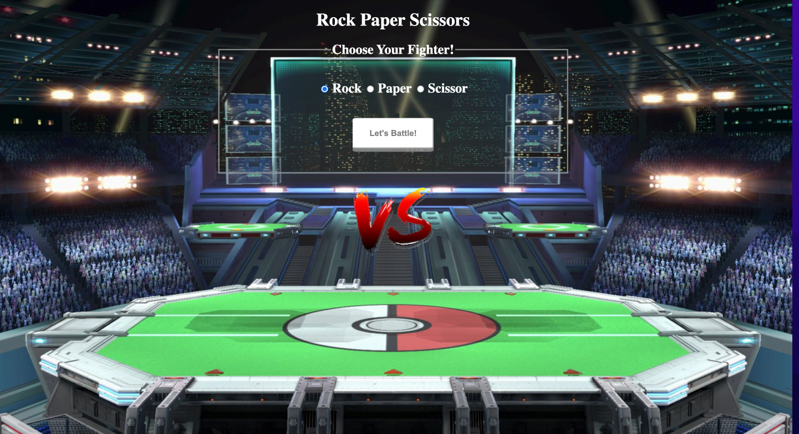

<h1 align="center">Hi 👋, I'm Elena (Damin) Kim</h1>
<h3 align="center">Full Stack Software Developer</h3>

- 🌱 I’m currently learning **Node.js , MongoDB**

- 📫 How to reach me **elenanana0903@gmail.com**
- 
- 👨‍💻 All of my projects are available at [https://chimerical-syrniki-0dfea3.netlify.app](https://chimerical-syrniki-0dfea3.netlify.app)

<h3 align="left">Connect with me:</h3>

<h3 align="left">Languages and Tools:</h3>

             

<h1 align="center">Projects</h1>
<table bordercolor="#66b2b2">
  
  <tr>
    <td width="50%" valign="top">
      <h3 align="center">RateMyMovie</h3>
         
        
         
        

          
  <a href="https://github.com/daminkim99/rateMyMovie" target="_blank">
    REPO(Github)
  </a>
          | 
  <a href="https://poised-deer-leg-warmers.cyclic.app" target="_blank">
    Website
  </a>
      

        
<strong>JavaScript | Bootstrap | Node.js | Express.js | MongoDB | EJS </strong> - A Project built on MVC architecture that allows users to write their reviews and provide their analysis of the movies they watch!

    </td>
    <td width="50%" valign="top">
      <h3 align="center">Rock Paper Scissor</h3>
         
      
         
        

          
  <a href="https://github.com/daminkim99/rock-paper-scissor" target="_blank">
    REPO(Github)
  </a>
      | 
  <a href="https://nice-erin-cormorant-sock.cyclic.app" target="_blank">
    Website
  </a>
      

        
<strong> Javascript | CSS3 | HTML5 | Node.js</strong> - Group Project: Rock Paper Scissors game against the random AI

    </td>
 </tr>
 <tr>
    <td width="50%" valign="top">
      <h3 align="center">luxurybeauty.com</h3>
         
      
         
        

      
  <a href="https://peppy-queijadas-a0ad95.netlify.app" target="_blank">
    Website
  </a>
      

        
<strong>  HTML5 | CSS3  </strong> - Static Website for lash lifting 

    </td>
  </tr>
   
